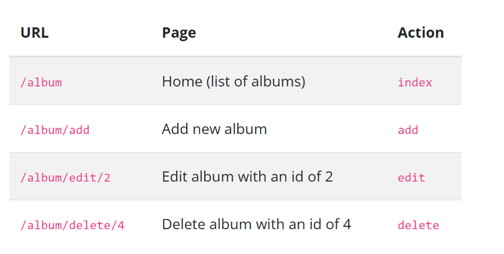

## Album Collection Laminas MVC 

This is a simple application for users to create, read, update and delete their favourite artists and albums using the Laminas MVC layer and module systems. 

An Album module has been created to contain controllers, models, forms, views, and configuration. The inventory system to display an album collection consists of four pages. 
- A home page displays the list of albums and provides links to edit and delete. Also, a link to enable adding new albums is provided.
- Adding a new album is a page which provides a form for adding a new album.
- Editing an album is a page providing a form for editing an album.
- Deleting an album is a page which confirms that we want to delete an album and then deletes it.

The route 'album' allows us to have the following URLs:


## Web Server
There are four ways to setup the web server:
- via the PHP built-in web server (for development only)
- via Vagrant
- via docker-compose
- using Apache

## The Database
- using Sqlite, via PHP's PDO driver
- Data persistence was performed using laminas-db's TableGateway to find, insert, update, and delete rows from a database table

### Using docker-compose

A `docker-compose.yml` is provided for use with
[docker-compose](https://docs.docker.com/compose/); it
uses the provided `Dockerfile` to build a docker image 
for the `laminas` container created with `docker-compose`.

Build and start the image and container using:

```bash
$ docker-compose up -d --build
```

At this point, you can visit http://localhost:8080 to see the site running.

You can also run commands such as `composer` in the container.  The container 
environment is named "laminas" so you will pass that value to 
`docker-compose run`:

```bash
$ docker-compose run laminas composer install
```

Some composer packages optionally use additional PHP extensions.  
The Dockerfile contains several commented-out commands 
which enable some of the more popular php extensions. 
For example, to install `pdo-pgsql` support for `laminas/laminas-db`
uncomment the lines:

```sh
# RUN apt-get install --yes libpq-dev \
#     && docker-php-ext-install pdo_pgsql
```

then re-run the `docker-compose up -d --build` line as above.

> You may also want to combine the various `apt-get` and `docker-php-ext-*`
> statements later to reduce the number of layers created by your image.


### Apache setup

To setup apache, setup a virtual host to point to the public/ directory of the
project and you should be ready to go! It should look something like below:

```apache
<VirtualHost *:80>
    ServerName laminasapp.localhost
    DocumentRoot /path/to/laminasapp/public
    <Directory /path/to/laminasapp/public>
        DirectoryIndex index.php
        AllowOverride All
        Order allow,deny
        Allow from all
        <IfModule mod_authz_core.c>
        Require all granted
        </IfModule>
    </Directory>
</VirtualHost>
```

### Nginx setup

To setup nginx, open your `/path/to/nginx/nginx.conf` and add an
[include directive](http://nginx.org/en/docs/ngx_core_module.html#include) below
into `http` block if it does not already exist:

```nginx
http {
    # ...
    include sites-enabled/*.conf;
}
```


Create a virtual host configuration file for your project under `/path/to/nginx/sites-enabled/laminasapp.localhost.conf`
it should look something like below:

```nginx
server {
    listen       80;
    server_name  laminasapp.localhost;
    root         /path/to/laminasapp/public;

    location / {
        index index.php;
        try_files $uri $uri/ @php;
    }

    location @php {
        # Pass the PHP requests to FastCGI server (php-fpm) on 127.0.0.1:9000
        fastcgi_pass   127.0.0.1:9000;
        fastcgi_param  SCRIPT_FILENAME /path/to/laminasapp/public/index.php;
        include fastcgi_params;
    }
}
```

Restart the nginx, now you should be ready to go!

### Conclusion
The most important part of applications built with laminas-mvc are the modules, the building blocks of any laminas-mvc application.

To ease the work with dependencies inside our applications, we use the service manager.

To be able to map a request to controllers and their actions, we use routes.

Data persistence was performed using laminas-db to communicate with a relational database. Input data is filtered and validated with input filters, and, together with laminas-form, they provide a strong bridge between the domain model and the view layer.

laminas-view is responsible for the View in the MVC stack, together with a vast amount of view helpers.